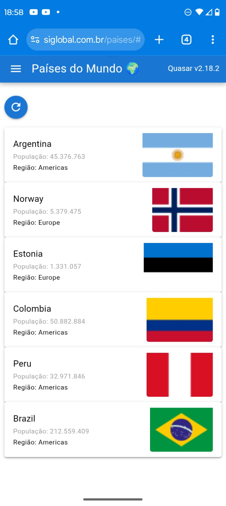
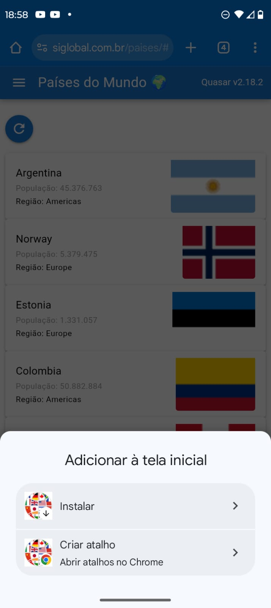
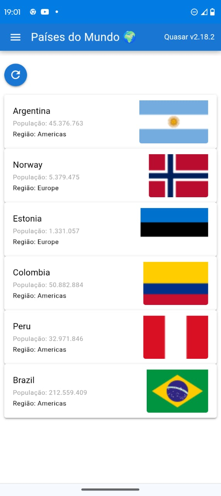

#  Quasar PWA - Countries Demo

Este é um projeto de demonstração utilizando **Quasar Framework (Vue.js)** no modo **PWA**.
O app consome a API [REST Countries](https://restcountries.com/) para exibir informações de países (nome, população, região e bandeira).

O objetivo é mostrar:
- Como transformar um app Quasar em **PWA** (instalável no celular ou desktop).
- Uso de **cache offline** para textos e imagens.
- Funcionamento mesmo **sem conexão à internet**.

---

##  Tecnologias

- [Vue.js 3](https://vuejs.org/) + [Quasar Framework](https://quasar.dev/)
- [Axios](https://axios-http.com/) (consumo de API)
- [Workbox](https://developer.chrome.com/docs/workbox/) (cache offline via service worker)
- [REST Countries API](https://restcountries.com/)

---
## Pré requisitos

PWA em produção funciona apenas com https

##  Instalação

1. Clone este repositório:
```bash
   git clone https://github.com/ivanrochacardoso/quasar-pwa-countries.git
   cd quasar-pwa-countries
```

2. Instale as dependências:

```bash
   npm install
```

3. Execute no modo desenvolvimento:

- Aqui usamos o modo `generateSW` com `router mode` em hash

- O servidor desenvolvimento usa o minimo do recurso pre-cache Service Worker da pasta public. Então o recurso offline não está disponivel em dev

```bash
   quasar dev -m pwa
```

4. Abra no navegador:


   http://localhost:9000/


---

##  Build para produção

```bash
quasar build -m pwa
# ou
npm build:pwa
```

Os arquivos prontos ficam em `dist/pwa`.

---

##  Testando o modo offline

1. Abra o app no navegador.
2. Clique em **Atualizar** para carregar os países.
3. Ative o **modo offline** no DevTools do navegador (Chrome: aba Network → Offline).
4. Recarregue a página.
5. O app continua funcionando, exibindo os países e bandeiras já cacheados.

---

##  Screenshots

### App Online



### Instalando PWA no Android


### Modo Offline


---

##  Artigos e Demonstração

Demonstração em `https://siglobal.com.br/paises/`

Este projeto faz parte da série de conteúdos sobre **PWA e sistemas offline** que será publicado no blog e redes sociais do **Siescola**.

---

##  Licença

MIT © 2025


---

